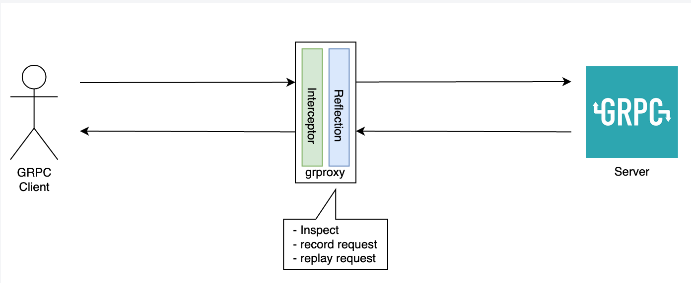

# grproxy
GRPC proxy to inspect, record, and reply requests



When you are debugging an issue, some time you want to know what is the GRPC client (eg: frontend application)
is sending and what the server (eg: backend application) sent back to the client. Normally This would 
involve putting log or print statement in both side. With _grproxy_ you can inspect the wire to see what 
actually being sent and received without changing the applications.

**Current limitations**
* Only support inspecting request and response
* Stream request/response is not logged
* Server needs to implement [reflection API](https://github.com/grpc/grpc/blob/master/doc/server-reflection.md)

**Planned for the future**
* Support recording the request to a file which can be used later on to simulate the
request in a different machine (eg: local dev laptop) multiple times.
* Filter on specific methods
* Reading the schema from a proto files definition

## Running
```
$ ./grproxy -addr "127.0.0.1:9999" -target "127.0.0.1:10000"
```

Arguments
* **addr** local address of the proxy
* **target** upstream (backend) of the GRPC server to forward to

## Running with docker

```
$ docker run --rm -it -p 9999:9999 yulrizka/grproxy:latest -target "host.docker.internal:10000"
```

`host.docker.internal` will be translated by Docker to the host IP address as a workaround
since OSX or Windows does not support `--net=host`. This is if you
bind remote GRPC server to your local machine (localhost). See example below.

## Example

Say that you are running a GRPC service **FooService** on remote kubernetes port **10000**.

To debug it, first you need to forward the grpc service port to localhost

```
$ kubectl port-forward svc/foo-service 10000:10000
```

At this point you will have the original GRPC server running on port **10000** locally.

Start the proxy on port 9999

```
$ docker run --rm -it -p 9999:9999 yulrizka/grproxy:latest -target "host.docker.internal:10000"
```

This will open the proxy on port **9999** on your local (host) machine that forward the request to `localhost:10000` which eventually
forward the request to the original (upstream) GRPC server.

In your app, you can start using the proxy as GRPC server.

```
# example listing all methods with grpcurl
$ grpcurl -plaintext localhost:9999 list

Fooservice
grpc.reflection.v1alpha.ServerReflection


# example calling a method (on a separate terminal)
$ echo '{"id":1}' | grpcurl -d @ -plaintext localhost:9999 Fooservice.GetUser

# output of the proxy
Fooservice.GetUser
{
  "id": "1"
}

response:
{
    "id": "1",
    "Name": "Jhon Doe"
}
```
